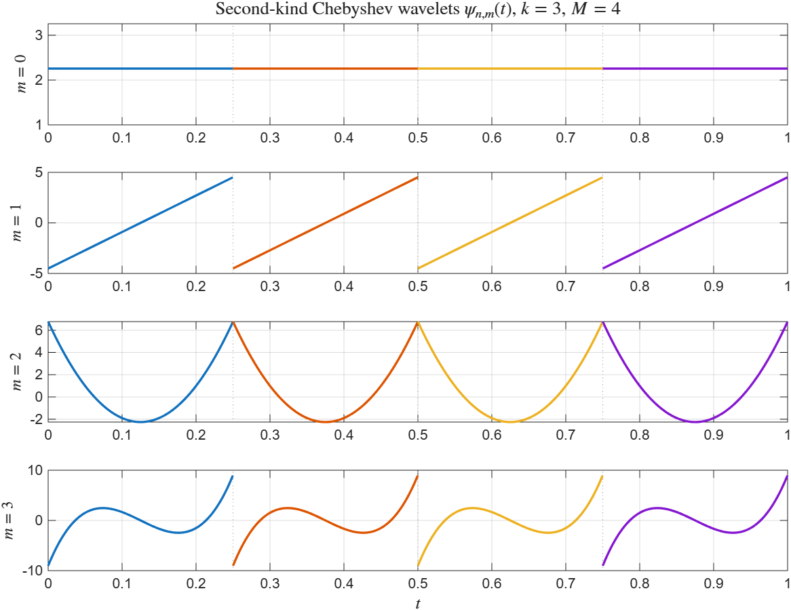
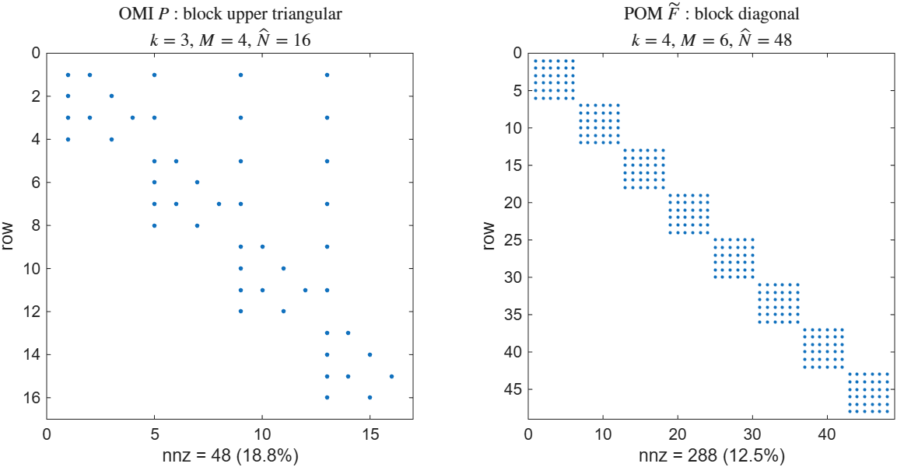
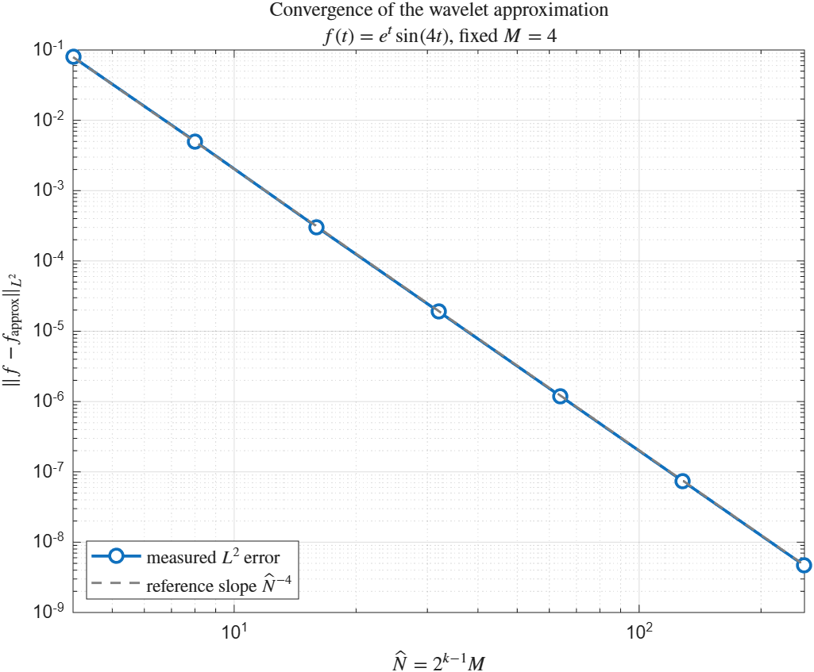
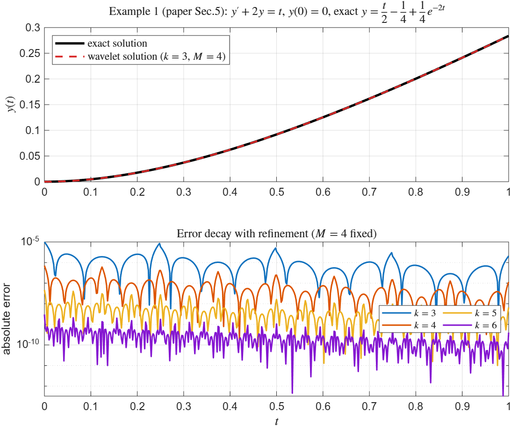
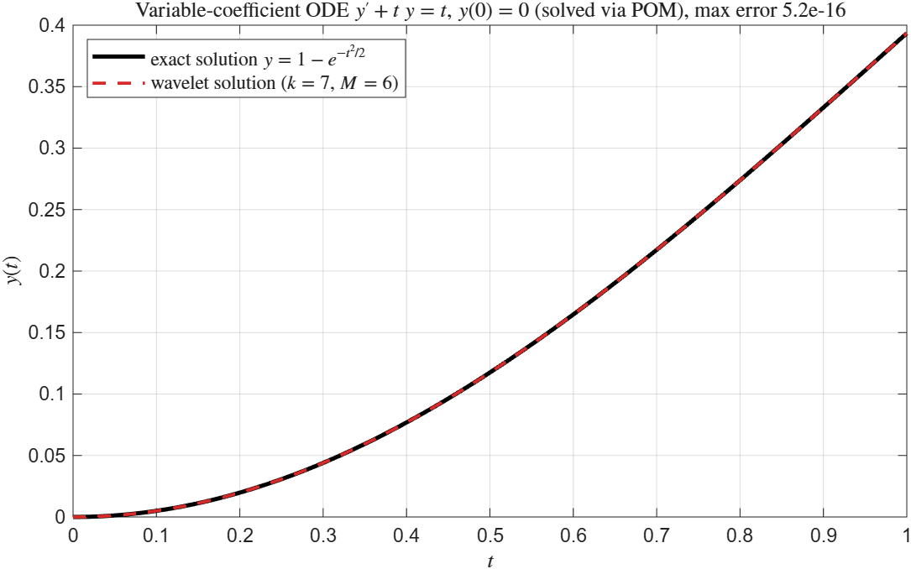
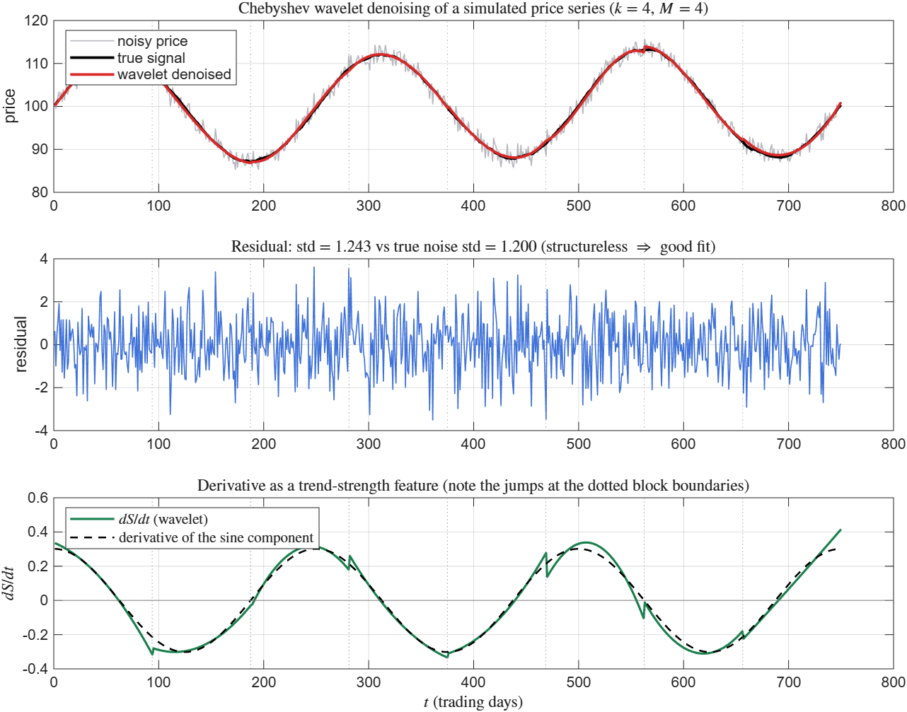
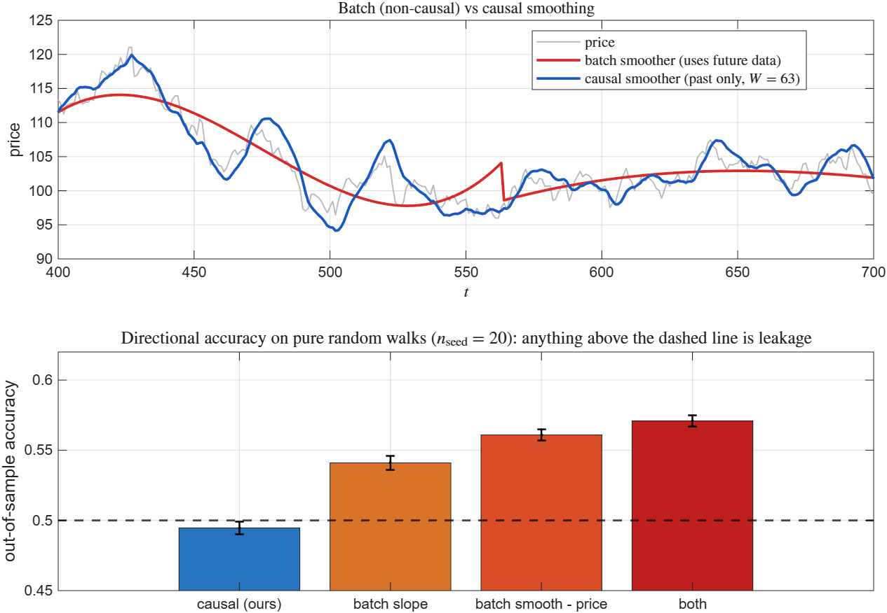

# chebyshev_wavelet_core

> 第二類 Chebyshev 小波（Second-kind Chebyshev Wavelets）之**積分運算矩陣（OMI）**與**乘積運算矩陣（POM）**的 MATLAB 高效能實作。
>
> *MATLAB implementation of the operational matrices of integration (OMI) and product operation matrices (POM) for second-kind Chebyshev wavelets, with GPU acceleration.*


本模組將論文中以 $k=3,\ M=4$ 手算列出的 $16\times16$ 矩陣，推廣為**任意解析度 $k$ 與任意多項式階數 $M$ 的通式實作**，並通過與原論文 Eq.(4.9) 的逐項比對（誤差為 0）。

---

## 目錄

- [理論背景](#理論背景)
- [系統需求](#系統需求)
- [快速開始](#快速開始)
- [API 參考](#api-參考)
- [數值驗證](#數值驗證)
- [效能基準](#效能基準)
- [數值特性與已知限制](#數值特性與已知限制)
- [與原論文的差異說明](#與原論文的差異說明)
- [應用範例：論文 Example 1](#應用範例論文-example-1)
- [應用模組：金融時間序列去噪](#應用模組金融時間序列去噪-wavelet_denoise_series)
- [應用模組：因果特徵萃取](#應用模組因果特徵萃取-wavelet_features)
- [專案結構](#專案結構)
- [引用](#引用)
- [授權](#授權)

---

## 理論背景

實作依據下列論文：

> H. K. Nigam and M. M. Alam, *Convergence analysis of an efficient Chebyshev wavelet and its applications to differential equations via operational matrices of integration*, **Tamkang Journal of Mathematics**, 57(3), 171–193, 2026. DOI: [10.5556/j.tkjm.57.2026.5958](https://doi.org/10.5556/j.tkjm.57.2026.5958)

### 小波定義（論文 Eqs. (2.1)–(2.3)）

$$
\psi_{n,m}(t)=
\begin{cases}
2^{k/2}\,\tilde{U}_m\!\left(2^k t-2n+1\right), & \dfrac{n-1}{2^{k-1}} \le t < \dfrac{n}{2^{k-1}},\\[2mm]
0, & \text{otherwise},
\end{cases}
\qquad
\tilde{U}_m(x)=\sqrt{\tfrac{2}{\pi}}\,U_m(x)
$$

其中 $n=1,\dots,2^{k-1}$、$m=0,\dots,M-1$，$U_m$ 為第二類 Chebyshev 多項式，滿足遞迴式 $U_{m+1}=2xU_m-U_{m-1}$。權函數經伸縮平移為 $w_n(t)=\sqrt{1-(2^kt-2n+1)^2}$，使基底在 $L^2_{w_n}[0,1)$ 中正交歸一：

$$\langle \psi_{n,m},\psi_{n',m'}\rangle_{w_n}=\delta_{nn'}\delta_{mm'}$$



*$k=3,\ M=4$ 的 16 個基底函數。同一列為相同多項式次數 $m$ 的 4 個平移；各函數僅在自己的子區間 $[\frac{n-1}{4},\frac{n}{4})$ 上非零，支撐互斥（虛線為子區間分界）。*

### 積分運算矩陣 OMI（論文 Eq. (4.8)、Thm 4.1）

$$
\int_0^t \Psi(\tau)\,d\tau \simeq P\,\Psi(t),
\qquad
P=\begin{pmatrix}
M & N & N & \cdots & N\\
O & M & N & \cdots & N\\
O & O & M & \cdots & N\\
\vdots & \vdots & \vdots & \ddots & \vdots\\
O & O & O & \cdots & M
\end{pmatrix},\qquad \hat{N}=2^{k-1}M
$$

本模組由 $\int U_m=\frac{T_{m+1}}{m+1}$ 與 $T_j=\frac{U_j-U_{j-2}}{2}\ (j\ge2)$ 推導出通式：

$$
\int_{-1}^{x}U_0 = U_0+\tfrac12 U_1,
\qquad
\int_{-1}^{x}U_m=\frac{U_{m+1}-U_{m-1}}{2(m+1)}+\frac{(-1)^m}{m+1}U_0 \quad (m\ge1)
$$

$$
M(m,j)=2^{-k}g_{m,j},
\qquad
N(m,1)=\begin{cases}\dfrac{2^{-k}\cdot 2}{m+1}, & m \text{ 為偶數}\\[2mm] 0, & m \text{ 為奇數}\end{cases}
$$

（$N$ 僅第一行非零：越過子區間後積分值為常數，只能由常數基底 $\psi_{n',0}$ 表示。）

### 乘積運算矩陣 POM（論文 Eqs. (4.16)–(4.19)）

$$F^{T}\Psi(t)\Psi^{T}(t)=\Psi^{T}(t)\tilde{F},\qquad \tilde{F}=\mathrm{blkdiag}(H_1,\dots,H_{2^{k-1}})$$

由線性化公式 $U_lU_j=\sum_{r=0}^{\min(l,j)}U_{l+j-2r}$ 與正交性 $\int_{-1}^{1}U_aU_i\sqrt{1-x^2}\,dx=\frac{\pi}{2}\delta_{ai}$ 得

$$
H_n(i,j)=\alpha\sum_{l}c_{n,l}\Lambda_{i,j,l},
\qquad \alpha=2^{k/2}\sqrt{2/\pi},
$$

$$
\Lambda_{i,j,l}=\begin{cases}1, & |l-j|\le i\le l+j \ \text{且}\ i\equiv l+j \pmod 2\\ 0, & \text{otherwise}\end{cases}
$$

不同子區間的小波支撐互斥，故 $\tilde{F}$ 的所有離對角區塊恆為零矩陣。



*左：OMI $P$ 的區塊上三角結構（$k=3,\ M=4$），對角為 $M$ 區塊、上三角為 $N$ 區塊。右：POM $\tilde{F}$ 的區塊對角結構（$k=4,\ M=6$），共 $2^{k-1}=8$ 個 $6\times6$ 區塊。*

---

## 系統需求

| 項目 | 需求 |
|---|---|
| MATLAB | **R2021a 以上**（`arguments` 區塊之 name-value 語法） |
| 必要工具箱 | 無（純 MATLAB 核心函式） |
| GPU 加速 | Parallel Computing Toolbox + CUDA 相容顯示卡（**選用**） |
| 記憶體 | 預設上限 24 GB，適用 32 GB 主機；可由 `'MemoryLimitGB'` 調整 |

未安裝 Parallel Computing Toolbox 或無可用 GPU 時，`use_gpu = true` 會發出警告並自動回退至 CPU，不會中斷執行。

## 安裝

```matlab
addpath('path/to/chebyshev_wavelet_core');
savepath;   % 選用：永久加入搜尋路徑
```

---

## 快速開始

最快的入門方式是直接執行示範腳本（涵蓋建構、驗證、收斂性、解 ODE 與效能量測）：

```matlab
demo_omi_pom
```

以下為個別功能的最小範例：

```matlab
%% 1. 論文情形 k = 3, M = 4，並執行自我驗證
[P, ~, info] = build_chebyshev_matrices(3, 4, false, [], 'Verify', true);
disp(info.verify)
%        paperEq49: 0              <- 與論文 Eq.(4.9) 逐項相同
%   orthonormality: 3.3573e-16
% integrationExactness: 1.1102e-16

%% 2. 建立 f(t) = t 對應的乘積運算矩陣 POM
E = info.expand(@(t) t);                       % 論文 Eq.(5.5)
[P, Ftilde] = build_chebyshev_matrices(3, 4, false, E);

%% 3. GPU 單精度加速（適合高頻資料的大量矩陣相乘）
Pg = build_chebyshev_matrices(10, 8, true, [], 'Precision', 'single');
class(Pg)      % gpuArray
A  = Pg * Pg;  % 在 GPU 上運算

%% 4. 超大型問題改用稀疏格式
[Ps, ~, is] = build_chebyshev_matrices(13, 8, false, [], 'Format', 'sparse');
fprintf('N = %d, 密度 = %.4f\n', is.N, nnz(Ps)/is.N^2);   % N = 32768, 密度 = 0.0313
```

---

## API 參考

```matlab
[P, Ftilde, info] = build_chebyshev_matrices(k, M, use_gpu, C, Name, Value)
```

### 位置引數

| 引數 | 型別 | 預設 | 說明 |
|---|---|---|---|
| `k` | 正整數 | — | 小波解析度，子區間數 $L=2^{k-1}$ |
| `M` | 正整數 | — | 多項式階數，$m=0,\dots,M-1$ |
| `use_gpu` | logical | `false` | 是否以 `gpuArray` 建構並保留於 GPU |
| `C` | double 向量 | `[]` | 長度 $\hat{N}=2^{k-1}M$ 的係數向量；提供時才計算 POM |

### 名稱－值選項

| 名稱 | 可選值 | 預設 | 說明 |
|---|---|---|---|
| `'Format'` | `'full'` \| `'sparse'` | `'full'` | 稀疏格式約可省下 $4M$ 倍記憶體（見[限制](#數值特性與已知限制)） |
| `'Precision'` | `'double'` \| `'single'` | `'double'` | 消費級 GPU 的 FP32 吞吐量遠高於 FP64，高頻資料建議 `'single'` |
| `'MemoryLimitGB'` | 正數 | `24` | 超過即報錯，避免 out-of-memory 或系統換頁 |
| `'Verify'` | logical | `false` | 執行自我驗證，結果寫入 `info.verify` |

### 輸出

| 輸出 | 說明 |
|---|---|
| `P` | 積分運算矩陣 OMI，$\hat{N}\times\hat{N}$ 區塊上三角矩陣 |
| `Ftilde` | 乘積運算矩陣 POM，區塊對角矩陣；未提供 `C` 時為 `[]` |
| `info` | 結構體，欄位如下 |

`info` 欄位：

| 欄位 | 說明 |
|---|---|
| `.N` `.L` `.k` `.M` | 矩陣階數 $\hat{N}$、子區間數 $L$、輸入參數 |
| `.alpha` | 尺度常數 $\alpha=2^{k/2}\sqrt{2/\pi}$ |
| `.Mblk` `.Nblk` | $M\times M$ 之對角／離對角區塊 |
| `.Lambda` | $M\times M\times M$ 三階線性化張量 $\Lambda_{i,j,l}$ |
| `.basis` | `@(t)` 求值 $\Psi(t)$，回傳 $\hat{N}\times$`numel(t)` |
| `.expand` | `@(fh)` 將函數投影為係數向量 $C$（Gauss–Chebyshev 求積） |
| `.device` `.precision` `.format` `.bytes` | 建構環境與記憶體用量 |
| `.timeOMI` `.timePOM` | 各階段建構耗時（秒） |
| `.verify` | `'Verify',true` 時的驗證結果 |

---

## 數值驗證

以 `'Verify', true` 執行，實測於 MATLAB R2026a：

| 檢驗項目 | $k=3, M=4$ | $k=5, M=6$ |
|---|---|---|
| 與論文 Eq.(4.9) 逐項比對 | **0** | — |
| 正交歸一性 $\langle\psi_i,\psi_j\rangle_w=\delta_{ij}$ | 3.36e-16 | 8.39e-16 |
| $P\Psi$ vs 閉式 $\int_0^t\Psi$（$m\le M-2$ 之列） | 1.11e-16 | 5.55e-17 |
| POM 投影一致性 $H_n(i,j)=\langle f\psi_j,\psi_i\rangle_w$ | 8.26e-16 | 1.62e-13 |
| POM 區塊對稱性 | 0 | 0 |

另以論文 Example 1（$y'+2y=t,\ y(0)=0$）作端對端驗證：本模組解得 $c_{1,0}=0.003866313244751$，與論文印出的 `0.00386631324475085` 一致；$\max|y_{\text{num}}-y_{\text{exact}}|=9.94\times10^{-6}$。

### 收斂階數

固定 $M=4$、逐次加密解析度 $k=1,\dots,7$，逼近 $f(t)=e^{t}\sin(4t)$：



實測 $L^2$ 誤差自 $7.9\times10^{-2}$ 單調降至 $4.6\times10^{-9}$，每提高一階 $k$ 誤差降低 $2^{4.00}$ 倍，與理論斜率 $\hat{N}^{-M}$（灰色虛線，兩線幾乎完全重合）一致。

| $k$ | 1 | 2 | 3 | 4 | 5 | 6 | 7 |
|---|---|---|---|---|---|---|---|
| $\hat{N}$ | 4 | 8 | 16 | 32 | 64 | 128 | 256 |
| $L^2$ 誤差 | 7.93e-02 | 5.04e-03 | 3.03e-04 | 1.90e-05 | 1.19e-06 | 7.43e-08 | 4.65e-09 |
| 收斂階 | — | 3.98 | 4.05 | 4.00 | 4.00 | 4.00 | 4.00 |

驗證項目 (c) 的參考值取**閉式反導函數** $\int_{-1}^{x}U_m=\frac{T_{m+1}(x)-T_{m+1}(-1)}{m+1}$ 而非數值求積——小波在子區間界點不連續，梯形法會在跨越跳躍時引入 $O(h)$ 誤差（實測會誤報約 2.3e-3）。

---

## 效能基準

測試環境：Intel Core i7-13620H（10 執行緒）／32 GB RAM／NVIDIA RTX 4060 Laptop GPU（8 GB）／MATLAB R2026a。
工作負載為 $P \times X$（$X$ 為同尺寸稠密資料矩陣），以 `timeit` / `gputimeit` 量測。

**⚠️ 關於 CPU 數據的重要說明**

本機實測發現 **CPU 端的 BLAS 吞吐量在不同 MATLAB 行程間可相差約 6 倍**（單精度 78 → 531 GFLOPS），推測與 MKL 執行緒池的暖機狀態有關：剛啟動的 `matlab -batch` 行程偏慢，已執行過大量運算的行程則接近硬體峰值。因此下表的 CPU 欄位以**觀測區間**呈現，GPU 欄位則在所有測試中穩定重現。**請勿把單一加速比當作本模組的效能保證，務必在自己的硬體上執行 `demo_omi_pom` 實測。**

| 精度 | $\hat{N}$ | GPU 時間 | GPU 吞吐量 | CPU 吞吐量（觀測區間） | 加速比區間 | CPU/GPU 差異 |
|---|---|---|---|---|---|---|
| double | 4096 | 0.85 s | 161 GFLOPS | 38 – 264 GFLOPS | **0.6× – 4.2×** | 1.1e-15 |
| single | 4096 | 0.026 s | ~5300 GFLOPS | 78 – 531 GFLOPS | **10× – 68×** | 6.0e-07 |
| single | 8192 | 0.20 s | ~5500 GFLOPS | 87 – 117 GFLOPS | **49× – 63×** | 8.6e-07 |

實測 GPU 吞吐量 FP32:FP64 $\approx$ 5300:161 $\approx$ 33:1，與 GeForce 架構 FP64 吞吐量為 FP32 的 1/64 的規格相符（含記憶體頻寬影響）。結論：

- **double 精度下 GPU 未必勝過 CPU**——當 CPU 處於良好狀態時，GPU 反而較慢（0.6×）。若計算對捨入誤差敏感（如病態線性系統求解），請維持 `double` 並留在 CPU。
- **single 精度才是 GPU 的適用場景**，此時加速一個數量級以上；代價是約 $10^{-7}$ 的相對誤差。

> **量測陷阱**：直接計時 `P*P` 會得到不可靠的結果。$P$ 有約 97% 的零元素，而 MATLAB 的 `zeros()` 對未寫入頁面採惰性配置。請先以 `P = P + 0;` 強制實體化所有記憶體頁，並改用具代表性的稠密工作負載（如 $P \times X$）。`demo_omi_pom.m` 第 7 節已採用此作法。

**建構耗時與記憶體：**

| 設定 | $\hat{N}$ | 格式 | nnz | 記憶體 | 建構時間 |
|---|---|---|---|---|---|
| $k=10,M=8$ | 4096 | full | — | 0.12 GB | ~0.1 s |
| $k=11,M=8$ | 8192 | full | — | 0.50 GB | ~0.3 s |
| $k=13,M=8$ | 32768 | sparse | 3.36e7 | 0.50 GB | ~0.5 s |
| $k=15,M=8$ | 131072 | sparse | 5.37e8 | 8.20 GB | ~12 s |

（建構時間同樣受行程狀態影響，此處取概略值；記憶體與 nnz 則為精確值。）

---

## 數值特性與已知限制

### 1. 基底截斷（方法本身的固有性質）

$P$ 與 $\tilde{F}$ 的每個元素皆為對應函數在 $L^2_{w_n}$ 中的**正交投影係數**，本身無捨入以外的誤差；但基底截斷於 $m=M-1$：

- **OMI**：$\int\psi_{n,m}$ 含 $U_{m+1}$ 項，故 $m\le M-2$ 的列可**精確**重現，$m=M-1$ 的列（各區塊最後一列）為最佳投影近似，誤差 $O(2^{-k}/(2M))$。此即論文的標準作法。
- **POM**：兩個 $M-1$ 次多項式相乘為 $2M-2$ 次，投影回 $M$ 維子空間必然捨去高次成分，因此 $\Psi^T\tilde{F}$ 只在 $L^2_w$ 意義下逼近 $F^T\Psi\Psi^T$（$k=3,M=4$ 時逐點殘差約 0.33）。**提高 $k$（加密子區間）比提高 $M$ 更能有效降低此誤差。**

### 2. 稀疏格式不是 $O(N)$

離對角區塊 $N$ 在每個右側區塊行皆重複出現，故

$$\mathrm{nnz}(P)\approx\frac{L^2}{2}\left\lceil \frac{M}{2}\right\rceil=\frac{\hat{N}^2}{4M}$$

密度趨近 $1/(4M)$（$M=8$ 時實測 0.0313）。稀疏格式僅省下約 $4M$ 倍記憶體，**不改變 $O(N^2)$ 的漸近行為**。`'MemoryLimitGB'` 的估算已依此公式計算（實測與實際配置量誤差 < 1%）。

### 3. 其他

- 稀疏矩陣在 MATLAB 中恆為 double，故 `'Format','sparse'` 會忽略 `'Precision'` 設定並發出警告。
- `'Format','sparse'` 不搬移至 GPU（`gpuArray` 對稀疏矩陣支援有限）。
- $M=1$ 時所有列皆受截斷影響，`info.verify.integrationExactness` 回傳 `NaN`。

---

## 與原論文的差異說明

論文的**通式** Eqs. (4.11)/(4.12) 與其**顯式** Eq. (4.9) 的 $16\times16$ 矩陣不一致：通式第一行給出 $\pm\frac{2}{(m-1)(m+1)}$ 型係數（如 $\frac{2}{15}$），而 Eq. (4.9) 的實際數值為 $\frac{2^{-k}}{m+1}$ 型。

本模組由定義重新推導，所得 $M$、$N$ 區塊與 **Eq. (4.9) 逐項完全相同（誤差 0）**，並經正交投影檢驗（誤差 $\sim10^{-16}$）確認正確，因此判定論文通式的排版有誤，實作採用與 Eq. (4.9) 一致的版本。

---

## 應用範例：論文 Example 1

求解一階線性初值問題 $y'(t)+2y(t)=t,\ y(0)=0$，精確解為 $y=\frac{t}{2}-\frac14+\frac14 e^{-2t}$。

令 $y'(t)=C^T\Psi(t)$，兩側自 0 積分並代入初始條件與 $t=E^T\Psi(t)$，由 Eq. (4.8) 得

$$(I+2P^T)C=P^TE$$

```matlab
[P, ~, info] = build_chebyshev_matrices(3, 4);

E  = info.expand(@(t) t);                         % 論文 Eq.(5.5)
C  = (eye(info.N) + 2*P.') \ (P.'*E);             % 論文 Eq.(5.7)
y  = @(t) (C.' * info.basis(t)).';                % y(t) = C^T \Psi(t)

tt = linspace(0, 1, 201).';
err = max(abs(y(tt) - (tt/2 - 1/4 + exp(-2*tt)/4)));
fprintf('max error = %.3e\n', err);               % max error = 9.942e-06
```



*上：$k=3,\ M=4$ 的小波解與精確解幾乎完全重合。下：固定 $M=4$ 加密 $k$ 時的絕對誤差，$k=3\to6$ 的最大誤差依次為 9.94e-06、7.02e-07、4.67e-08、3.01e-09。*

### 變係數 ODE：POM 的實際應用

$$y'(t)+t\,y(t)=t,\qquad y(0)=0,\qquad \text{精確解 } y=1-e^{-t^2/2}$$

令 $y'=C^T\Psi$，則 $y=(P^TC)^T\Psi=:D^T\Psi$。變係數項以 POM 處理：$a(t)y(t)=(A^T\Psi)(\Psi^TD)=\Psi^T\tilde{A}D$，代入後得

$$(I+\tilde{A}P^T)\,C=G$$

```matlab
[Pv, ~, iv] = build_chebyshev_matrices(7, 6);
Av = iv.expand(@(t) t);                    % a(t) = t
Gv = iv.expand(@(t) t);                    % g(t) = t
[~, Atl]    = build_chebyshev_matrices(7, 6, false, Av);

Cv = (eye(iv.N) + Atl*Pv.') \ Gv;          % y' 的係數
Dv = Pv.' * Cv;                            % y 的係數（y(0)=0）
```



*$k=7,\ M=6$ 時最大誤差 $5.2\times10^{-16}$，已達機器精度。$k=3/5/7$ 的誤差依次為 8.20e-09、2.11e-12、5.18e-16。*

---

## 應用模組：金融時間序列去噪 `wavelet_denoise_series`

資料處理管線的第一步：將 1D（或多檔並排的 2D）時間序列投影至小波空間、濾除高頻雜訊，並同步輸出一階導數作為趨勢強弱特徵。

```matlab
[S_smooth, dS_dt, C, diagOut] = wavelet_denoise_series(S, T, k, M, Name, Value)
```

### 三個核心機制

**1. 投影**：時間軸正規化至 $\tau\in[0,1]$ 後，以 Gauss–Chebyshev 求積計算內積。因基底於各子區間支撐互斥，投影可逐區塊獨立進行，全程化為單一矩陣乘法 $(M\times Q)(Q\times L\cdot n_{\text{series}})$，無區塊或標的迴圈。

**2. 去噪**：平滑效果的主要來源是**維度縮減本身**（$\hat{N}=2^{k-1}M \ll n_{\text{obs}}$），另提供次數截斷 `'KeepDegree'` 與係數閾值 `'Threshold'` 兩種可疊加的機制。

**3. 一階導數**：微分將 $m$ 次多項式降為 $m-1$ 次，仍落在同一小波空間內，故存在**精確**的區塊對角微分矩陣 $D$，滿足 $\frac{d}{dt}\Psi(t)=D\,\Psi(t)$。由 $U'_m = 2\sum_{j=m-1,m-3,\dots}(j+1)U_j$ 得

$$D_{m,j} = 2^{k}\cdot 2(j+1),\qquad j = m-1,\, m-3,\, \dots$$

此處**不採用對 OMI 求逆**的作法：$P$ 的各區塊最後一列已捨去 $U_M$ 項，求逆會放大該截斷誤差與殘餘雜訊。$D$ 與 OMI 的一致性可由 $\int_0^t\Psi = P\Psi$ 兩側微分所得的恆等式驗證：

$$P\,D = I$$

實測在各區塊 $m\le M-2$ 的列上誤差為 **0**（機器精度），僅 $m=M-1$ 的列偏離恰好 1.0——正是 $P$ 所捨去的 $U_M$ 項。這是兩個模組數學一致性的交叉驗證。

### 實測基準

模擬價格（sine + random walk + 高斯雜訊，$n=750$、雜訊 std 1.2），30 次隨機實驗的平均 RMSE：

| 方法 | RMSE vs 真實訊號 |
|---|---|
| **k=4, M=4 純投影** | **0.284** |
| Savitzky–Golay (3, 41) | 0.292 |
| movmean(21) | 0.325 |
| k=5, M=4, `KeepDegree=2` | 0.330 |
| k=6, M=4, `Threshold='auto'` (hard) | 0.478 |
| 原始含噪資料 | 1.197 |

導數作為趨勢特徵：$k=4$ 時與真實導數的相關係數達 **0.996**，而直接對含噪資料取差分僅 0.122。



*上：去噪結果與真實訊號幾乎重合。中：殘差無結構，表示擬合良好。下：導數準確追蹤真實趨勢，但在子區間界點（虛線）有可見跳躍。*

### 兩點務必知悉的限制

**閾值化在此類資料上並未勝過純投影**（見上表）。原因是本基底屬**分段多項式迴歸基底**，雜訊能量分散於各多項式次數，而非如傳統多解析度小波般稀疏集中，Donoho–Johnstone 的稀疏性假設不成立。此選項預設關閉，保留給雜訊確實稀疏或含脈衝的情境。**請優先調整 $k$**，起始經驗值為每個子區間約 100 個資料點，即 $k \approx \log_2(n_{\text{obs}}/100)+1$。

**子區間界點不連續**：各 $\psi_{n,m}$ 支撐互斥且未施加接合條件，重建序列在 $L-1$ 個界點上會有跳躍。實測即使最佳參數仍達 std(S) 的 15–20%（上圖第三欄清楚可見），$k$ 過大時超過 30%（此時函數會發出警告）。`diagOut.maxBlockJumpRel` 會回報此量。若下游策略對界點附近的導數尖峰敏感，請設遮罩或改用具連續性約束的平滑器。

### 其他

支援 `datetime` / `duration` 時間軸（導數自動以「每日」為單位）、NaN 自動內插補值、非均勻取樣，以及 $n_{\text{obs}}\times n_{\text{series}}$ 的多標的矩陣輸入（多檔與逐檔迴圈結果一致，差異 $4.3\times10^{-14}$）。完整參數說明請執行 `help wavelet_denoise_series`。

---

## 應用模組：因果特徵萃取 `wavelet_features`

資料處理管線的第二步，也是接上預測模型前的必要環節。

```matlab
[F, featNames, causal, diagOut] = wavelet_features(S, T, Name, Value)
```

### 為什麼需要這一步

`wavelet_denoise_series` 把整段序列一次投影，時刻 $t$ 的平滑值用到了 $t$ **之後**的資料。作為事後分析與繪圖的工具沒有問題，但拿去餵預測模型就是典型的 look-ahead bias。本模組改以滾動視窗，確保時刻 $t$ 的特徵只用到 $S(1..t)$。

這不是理論顧慮。在**純幾何隨機漫步**上做次日漲跌方向預測（ridge、前 70% 訓練、後 30% 樣本外、40 次獨立實驗）——隨機漫步不具可預測性，樣本外準確率顯著高於 0.5 就只可能來自資料洩漏：

| 特徵來源 | 樣本外準確率 | 距 0.5 |
|---|---|---|
| **本模組（因果）** | **0.5007 ± 0.0038** | **+0.2 SE** |
| 批次去噪的斜率 | 0.5341 ± 0.0041 | +8.3 SE |
| 批次平滑值 − 收盤價 | 0.5630 ± 0.0033 | +18.8 SE |
| 上述兩者合用 | 0.5748 ± 0.0034 | +22.3 SE |

非因果特徵在毫無訊號的資料上可虛增最多 **7.5 個百分點**的樣本外準確率。反向驗證：改用含真實週期成分的序列，本模組特徵的樣本外準確率為 **0.7066 ± 0.0042**（多數類基準 0.5197）——無訊號時不捏造訊號，有訊號時抓得到。



*上：批次平滑器（紅）用到未來資料，曲線平滑但不可用於建模；因果平滑器（藍）只用過去資料，必然較晚反應。下：隨機漫步上的方向準確率，虛線以上的部分全部是洩漏。*

### 設計依據（兩項實測）

**預設 `Weighting='uniform'`**：論文的權函數 $w=\sqrt{1-x^2}$ 在 $x=\pm1$ 歸零，恰好把「最新的觀測值」權重壓到最低，對因果特徵不利。實測視窗右端的估計誤差，均勻最小平方較加權投影低約 25%：

| $W=63,\ M=4$ | 右端值 RMSE | 右端斜率 RMSE |
|---|---|---|
| uniform | **0.0449** | **0.819** |
| chebyshev | 0.0642 | 0.924 |

**預設 `k=1`**：本基底於子區間支撐互斥，故 $k\ge2$ 時「視窗右端的值與斜率只取決於最後一個子區間的 $W/2^{k-1}$ 個點」——實測改動視窗前半段資料，右端特徵變化量恰為 **0**。這使 $W$ 與 $k$ 在右端特徵上互相抵消，因此多尺度資訊改由多組**視窗長度** `'Windows'` 提供。

### 特徵集

每個視窗長度產生 6 個無因次特徵（預設 `Windows = [21 63 252]`，即 18 個特徵）：

| 特徵 | 定義 | 意義 |
|---|---|---|
| `trend` | $\dfrac{dS/d\tau}{S}$ | 一個視窗長度內的相對變化 |
| `trendT` | $\dfrac{dS/d\tau}{\sigma_{\text{res}}}$ | 以殘差標準差標準化的趨勢強度（類 $t$ 統計量） |
| `curv` | $\dfrac{d^2S/d\tau^2}{S}$ | 曲率／加速度，偵測趨勢轉折 |
| `dev` | $\dfrac{S(t)-\hat{S}(t)}{\sigma_{\text{res}}}$ | 標準化偏離（均值回歸訊號） |
| `vol` | $\dfrac{\sigma_{\text{res}}}{S}$ | 視窗內相對波動度 |
| `rough` | $\dfrac{\sum_{m\ge2}E_m}{\sum_{m\ge1}E_m}$ | 高次係數能量佔比（走勢非線性程度） |

導數同樣由區塊對角微分矩陣 $D$ 求得，二階導數即連續作用兩次：$\frac{d^2S}{d\tau^2}=\Psi^{T}(D^{T})^{2}C$。獨立逐點重算驗證，平滑值、`trend`、`curv` 的差異皆在 $10^{-13}$ 以下。

### 與預測目標的對齊

```matlab
[F, names] = wavelet_features(S, T);
y   = [sign(diff(S)); NaN];        % y(t) = 下一期漲跌方向
ok  = all(isfinite(F), 2) & isfinite(y);
Xtr = F(ok, :);   ytr = y(ok);
```

**切勿把 `F` 往前移以「對齊」標籤**——那會直接製造前視偏誤。切分訓練/測試集必須依時間先後（walk-forward），不可隨機切分。

`'Verify', true` 會執行因果性自我檢驗：擾動未來資料後，過去的特徵必須完全不變（`diagOut.leakTest` 應為 0，否則直接報錯）。

### 效能

視窗長度固定且觀測序號等距時，投影運算子對每個視窗完全相同，故先建構一次 $(N\times W)$ 的線性運算子，再以單一矩陣乘法作用於所有視窗，時間軸完全向量化。實測 20 檔 × 1500 筆共 18 個特徵約 0.27 秒；多標的與逐檔迴圈的結果差異 $3.5\times10^{-13}$。

---

## 專案結構

```
chebyshev_wavelet_core/
├── build_chebyshev_matrices.m   % 主函數（含 5 個局部函數：基底求值、
│                                %   函數展開、自我驗證、閉式反導函數、
│                                %   Chebyshev 多項式遞迴）
├── wavelet_denoise_series.m     % 應用模組 1：金融時間序列去噪與趨勢特徵
├── wavelet_features.m           % 應用模組 2：因果特徵萃取（供預測模型使用）
├── demo_omi_pom.m               % 示範腳本（9 個章節，見下）
├── figures/                     % README 所用圖檔（由示範腳本產生）
│   ├── fig_basis.png
│   ├── fig_structure.png
│   ├── fig_convergence.png
│   ├── fig_example1.png
│   ├── fig_varcoef.png
│   ├── fig_denoise.png
│   └── fig_causal.png
├── README.md
└── LICENSE
```

圖檔可隨時重新產生：將 `demo_omi_pom.m` 開頭的 `EXPORT_PNG` 設為 `true` 後執行，即會輸出至 `figures/`（圖表文字採英文，因 MATLAB 預設字型不含 CJK 字元，中文標籤在匯出的 PNG 中會顯示為方框）。

### 示範腳本

```matlab
demo_omi_pom      % 完整執行，或在編輯器中以 Ctrl+Enter 逐節執行
```

| 章節 | 內容 |
|---|---|
| 1 | 建構 OMI 並與論文 Eq.(4.9) 逐項比對，繪製區塊上三角結構 |
| 2 | 16 個基底函數 $\psi_{n,m}(t)$ 視覺化 |
| 3 | 函數逼近收斂階數驗證（實測每提高一階 $k$ 誤差降低 $2^{4.00}$ 倍，符合理論 $2^M$） |
| 4 | POM 的區塊對角結構，及「乘積次數是否超出基底」造成的截斷效應對照 |
| 5 | 論文 Example 1：$y'+2y=t$，並列出 $k=3\dots6$ 的誤差收斂 |
| 6 | 變係數 ODE $y'+ty=t$：POM 的實際應用 |
| 7 | 稀疏格式與 CPU/GPU 效能量測 |
| 8 | 金融時間序列去噪與趨勢特徵（`wavelet_denoise_series`），含 $k$ 的參數掃描 |
| 9 | 因果特徵萃取與前視偏誤量化（`wavelet_features`），20 次隨機實驗 |

## 引用

若本模組對您的研究有幫助，請引用原論文：

```bibtex
@article{Nigam2026Chebyshev,
  author  = {Nigam, Hare Krishna and Alam, Md Mahtab},
  title   = {Convergence analysis of an efficient {C}hebyshev wavelet and its
             applications to differential equations via operational matrices
             of integration},
  journal = {Tamkang Journal of Mathematics},
  volume  = {57},
  number  = {3},
  pages   = {171--193},
  year    = {2026},
  doi     = {10.5556/j.tkjm.57.2026.5958}
}
```

## 授權

本專案採用 [MIT License](LICENSE)，Copyright (c) 2026 Kao, En-Tsai。
